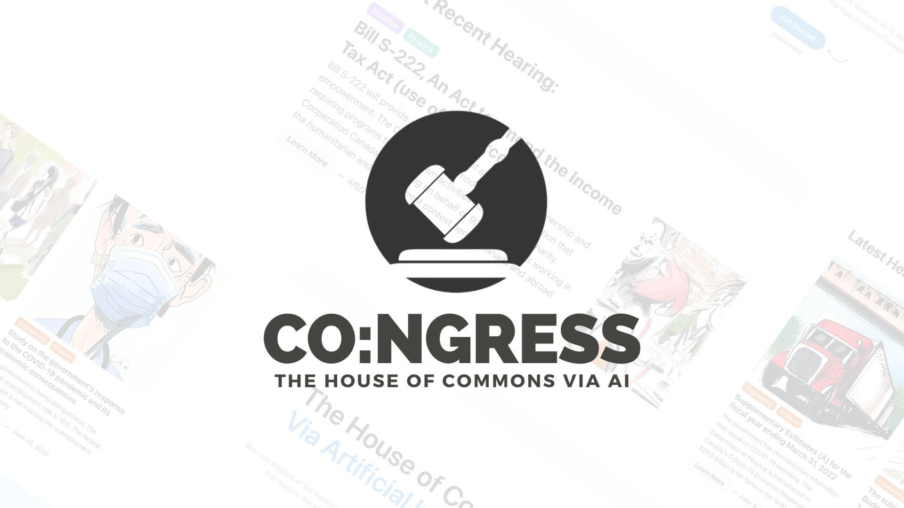

## HackTheValley7 - co:ngress 

<h6 align="center">
  

  
</h6>

---

## Inspiration:

We were inspired by the fact that a TL:DR is included at the start/end of most news articles, but there was no TL:DR for parliament hearings. News outlets are a great way of keeping track of what's going on in Canada, but news mostly consists of mainstream headlines and is not at all inclusive of all decisions that are being made in our country. We saw the opportunity, and went for it! A TL:DR for parliament hearings!

## What It Does: 

Our app scrapes proceedings from the House of Commons of Canada and runs it through the Article Summarization feature of Cohere API.

Once summarized, it roughly interprets the topic of the hearing and passes it as a prompt to Wombo API, fetching an AI-generated image, as a small entertainment factor for the user.

For scalability, it also stores summaries and AI-images for each proceeding in a database, so that if N users request to see the summary of a proceeding, it does not have to scrape and summarize N times, but only one time. After that, it will fetch the same result from the database. 
